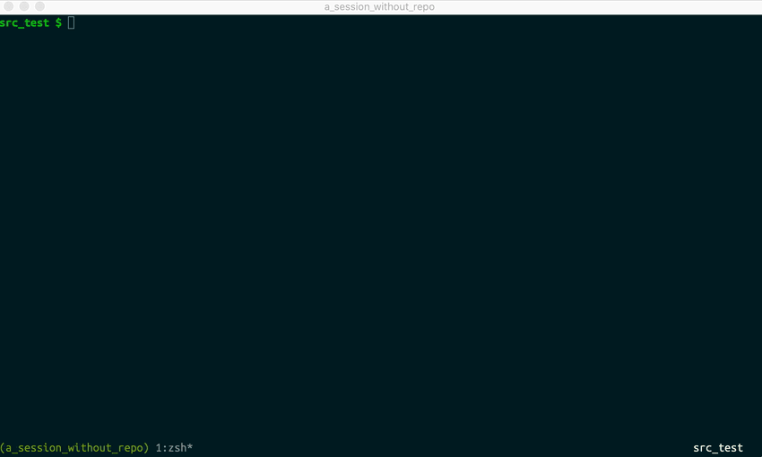

# Tmux Project Switcher

Quickly switch between tmux sessions that represent a project/repo.



`tmux-project-switcher` will open a popup with all those leaf folders, where
you'll be able to fuzzy find a project you can switch to. When selected, it will
either switch to that session or create a new session, and change into the right directory.

## Requirements

- [fzf](https://github.com/junegunn/fzf)
- Ruby
- Tmux >= 3.2 (still a rc)
- (optional) Works well with [`gh`](https://github.com/jdxcode/gh) for quickly cloning projects
  
### Tmux 3.2 popup window

This plugin works with the popup window, which is only supported in some of the
newer tmux versions. If you use `brew` you can install it with `brew install --HEAD tmux`

To check if that's working fine run inside a tmux session `tmux popup`. An empty popup should appear.

## Installation with [TPM](https://github.com/tmux-plugins/tpm)

Add plugin to the list of TPM plugins in ~/.tmux.conf:

```
set -g @plugin 'dgmora/tmux-project-switcher'
```

`tmux-prefix` + `I` to install the plugin

## Usage

Follow the setup section and use `ctrl + opt + p` to see a list of repos/sessions. Note
that it's expected that you are within tmux when running this.

## Setup

The default configuration assumes that you have a file structure like this:

```
$HOME
│
└── src
    ├── github.com
    │     ├── dgmora
    │     │   ├── repo1
    │     │   └── tmux-project-switcher
    │     └── tmux
    │         └── repo3
    └── github.myenterprise.com
          └── DavidMora
              └── an-enterprise-repo
```

- A root folder with all your projects in `$HOME/src`.
- Your projects are at depth `3` from that folder. This is important becaus what you see
in the popup will be all folders at that depth from the root. 1st level would be `github.com`,
second `dgmora` and third `tmux-project-switcher`.
- The "meaningful name" of the project is the last `2` folders. i.e. `dgmora/tmux-project-switcher`.
this will be used for the tmux session name. 2 is used because of git forks. 1 can be used but
won't work super well if you have forks
- The default key to trigger the switcher is `-n C-m-p`, so `ctrl + opt + P` (_without_ prefix).
 
### Changing default settings

Most of settings can be overwritten so you can use a different file structure.

You can overwrite the **default key** by adding this to your `tmux.conf`:

```
set -g @switcher-key 'C-M-t' # This would be ctrl + M + t with prefix
set -g @switcher-key '-n C-M-i' # This would be ctrl + M + i without prefix
```

Note that with some keys you can have issues with `vim`, so it might be that some of them don't work.

To overwrite the **base folder**, these settings are taken into account: `GH_BASE_DIR` if set
(used by [`gh`](https://github.com/jdxcode/gh) too). `TMUX_PROJECT_SWITCHER_ROOT_FOLDER` if set. Or `$HOME/src` as default

For the **depth**: `TMUX_PROJECT_SWITCHER_PROJECT_DEPTH` if set, or `3` 

For the number of folders used to **name** the session: `TMUX_PROJECT_SWITCHER_FOLDERS_AMOUNT` if set,  `2`

To change the **popup itself**, you can change `TMUX_PROJECT_SWITCHER_FZF_COMMAND`. The default is `fzf-tmux -w80% -h100% --preview ''`

## Credits

[TPM](https://github.com/tmux-plugins/tpm) for making it so easy to create tmux plugins

https://github.com/schasse/tmux-jump for inspiration on how to make it work with ruby!

https://github.com/dergachev for making screengif

https://github.com/jdxcode/gh to come up with such a simple but great idea to organize your repos
